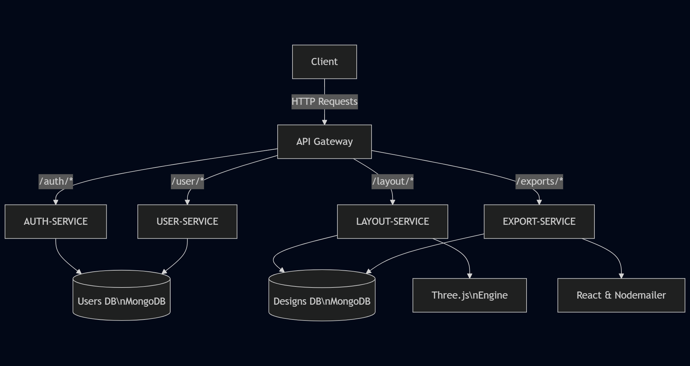
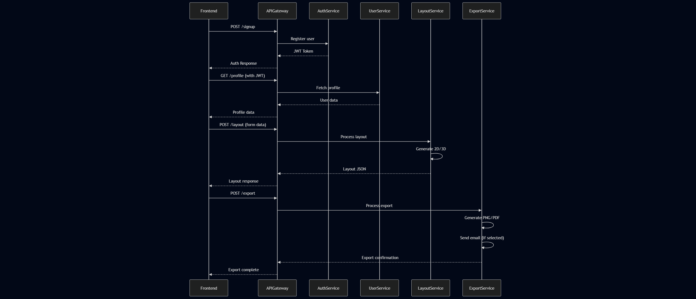
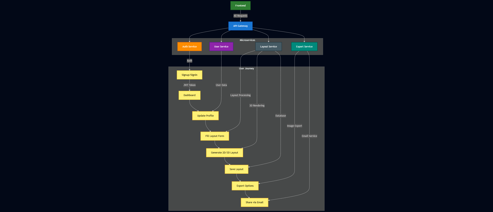

# ArchitechX


**ArchitechX** is an architectural design platform that automates the creation of custom building layouts. By inputting simple requirements (e.g., room dimensions, floors, and styles), users receive **instant, optimized 3D and 2D floor plans** with real-time editing capabilities.  

---

## 📑 Table of Contents

1. [Why ArchitechX?](#why-architechx)  
2. [🛠 Tech Stack](#-tech-stack)  
   - [Frontend](#frontend)  
   - [Backend](#backend)  
   - [Database](#database)  
   - [Deployment](#deployment)  
3. [✨ Features](#-features)  
   - [🚪 User Management](#-user-management)  
   - [🏗️ Design Creation](#-design-creation)  
   - [🎨 Interactive Editing](#-interactive-editing)  
   - [💾 Project Management](#-project-management)  
   - [⚙️ System Features](#-system-features)  
4. [🌐 Microservices Architecture](#-microservices-architecture)  
   - [Communication Flow](#communication-flow)  
   - [Data Isolation](#data-isolation)  
5. [Data Flow](#data-flow)  
6. [API Connection](#api-connection)  
7. [🏗️ Service Architecture](#-service-architecture)  
8. [🚀 User Workflow](#-user-workflow)  
   - [1. Authentication](#1-authentication)  
   - [2. Design Specification](#2-design-specification)  
   - [3. Layout Generation](#3-layout-generation)  
   - [4. 3D Model Creation](#4-3d-model-creation)  
   - [5. Real-Time Customization](#5-real-time-customization)  
   - [6. Save & Export](#6-save--export)  
   - [7. Sharing](#7-sharing)  
9. [📜 License](#-license)

---

### Why ArchitechX?  
- **🚀 Speed**: Generate designs in minutes, not weeks.  
- **🎨 Customization**: Modify every detail (walls, textures, furniture) in an interactive 3D editor.  
- **🤖 Good Algorithm**: Algorithms optimize space usage and structural feasibility.  
- **🌐 Scalable**: Built with microservices for seamless performance.  
- **🌐 Security**: Incorporates JWT-based authentication and encrypted user credentials.  

**Ideal for**: Homeowners, architects, real estate developers, and interior designers. 

## 🛠 Tech Stack

### Frontend
| Category              | Technologies & Packages                                                                 |
|-----------------------|----------------------------------------------------------------------------------------|
| **Core Framework**    | React, React DOM                                                                       |
| **3D Rendering**      | Three.js, @react-three/fiber, @react-three/drei, @react-three/postprocessing           |
| **2D Canvas**         | Fabric.js, Konva, react-konva                                                         |
| **UI Components**     | Lucide React, React Icons, React Feather, Tweakpane                                   |
| **Forms & Validation**| React Hook Form, Formik/Yup                                                           |
| **Drag & Drop**       | React DnD (with HTML5 backend)                                                       |
| **Color Picker**      | React Colorful                                                                        |
| **Measurement Tools** | React Ruler, React Measure                                                            |
| **Authentication**    | Google OAuth, React Google ReCaptcha                                                  |
| **Routing**           | React Router DOM                                                                      |
| **Utilities**         | Axios, FileSaver, html-to-image, html2canvas                                         |
| **Notifications**     | React Toastify                                                                        |
| **Captcha**           | React Simple Captcha                                                                  |
| **Styling**           | Tailwind CSS                                                                          

### Backend
| Category                | Technologies & Packages                                                                 |
|-------------------------|----------------------------------------------------------------------------------------|
| **Core Framework**      | Express                                                                               |
| **Database**            | Mongoose (MongoDB ODM)                                                                |
| **Authentication**      | JWT, Google Auth Library, Bcrypt/BcryptJS                                            |
| **API Security**        | CORS, Express Rate Limit, Express Validator                                           |
| **File Processing**     | Multer, Cloudinary                                                                    |
| **Email Services**      | Nodemailer, SendGrid                                                                  |
| **Message Queues**      | AMQPLib (RabbitMQ)                                                                    |
| **Environment Mgmt**    | Dotenv                                                                                
| **Utilities**           | Cookie Parser, Crypto, HTTP Proxy Middleware                                         |

### Database
| Category          | Technologies               |
|-------------------|----------------------------|
| **Primary DB**    | MongoDB                    |
| **ODM/ORM**       | Mongoose                   |
| **Caching**       | Redis (optional)           |

### Deployment
| Category          | Technologies               |
|-------------------|----------------------------|
| **Containerization** | Docker                   |
| **Hosting**       | Render , Vercel                |
| **CI/CD**         | GitHub Actions/GitLab CI (optional) |


## ✨ Features

### 🚪 User Management
- **Secure Authentication**: JWT-based signup/login with session management
- **Admin Dashboard**: Monitor users and projects (optional)

### 🏗️ Design Creation
- **Requirements Input**: Specify rooms, dimensions, and floors via intuitive forms  
- **2D Layout Generation**: Automated floor plan creation with rule-based logic
- **3D Model Conversion**: Instant 3D visualization from 2D layouts

### 🎨 Interactive Editing
- **Real-time 3D Preview**: Rotate, zoom, and walkthrough models
- **Material Customization**: Paint walls and apply textures
- **Modular Adjustments**: Resize/reshape rooms with drag-and-drop

### 💾 Project Management
- **Export Options**: Download as images or 3D model files (OBJ, etc.)
- **Collaboration Tools**: Real-time multi-user editing (in future)

### ⚙️ System Features
- **Microservices API**: Scalable backend with service mesh routing
- **Notifications**: Email alerts for project updates
- **Admin Controls**: Manage users and system metrics (in future)


## 🌐 Microservices Architecture



### Communication Flow
1. **Client** → **API Gateway** (Reverse proxy)
2. **Gateway** routes to specific services:
   - Authentication → `auth-service`
   - User profiles → `user-service`
   - Design generation → `layout-service` 
   - File exports → `export-service`

### Data Isolation:
- **Auth/User Services**: Share Users DB (MongoDB)
- **Layout/Export Services**: Share Designs DB (MongoDB)
- **File Storage**: Export-Service uses Nodemailer , CanvastoHtml


## Data Flow




## API connection




## 🏗️ Service Architecture

| Service            | Description                                                                 | Repository Link                                   |
|--------------------|-----------------------------------------------------------------------------|--------------------------------------------------|
| **Frontend**       | React-based UI with 3D editor and design tools                              | [frontend](https://github.com/aaradhayasingh811/ArchitechX_frontend) |
| **API Gateway**    | Entry point for all requests, handles routing and auth                      | [api-gateway](https://github.com/aaradhayasingh811/api-gateway-Architechx) |
| **User Service**   | Manages user profiles, project lists, and preferences                       | [user-service](https://github.com/aaradhayasingh811/user-service) |
| **Auth Service**   | Handles authentication (JWT/OAuth) and session management                   | [auth-service](https://github.com/aaradhayasingh811/auth-service) |
| **Layout Service** | Generates 2D floor plans and converts to 3D models                         | [layout-service](https://github.com/aaradhayasingh811/layout-service) |
| **Export & Notification Service**   | Sends emails and in-app alerts for system events                            | [export-service](https://github.com/aaradhayasingh811/export-service) |


## 🚀 User Workflow
### 1. Authentication
- User signs up/logs in through the frontend
- Auth Service validates credentials and returns a JWT
- Frontend stores the token securely for subsequent requests

### 2. Design Specification
- User inputs:
- Number of rooms
- Dimensions (width/length/height)
- Special requirements (e.g., "open kitchen")
- Frontend sends this data to the Layout Service

### 3. Layout Generation
- Layout Service processes requirements and:
- Creates optimized 2D floor plan
- Validates structural feasibility
- Returns JSON structure with room positions/wall data

### 4. 3D Model Creation
- 3D Service converts the 2D layout into:
- Three.js-compatible scene graph
- Wall meshes to paint
- Basic lighting setup
- Model loads in the browser in less than 5 seconds.

### 5. Real-Time Customization
- Users can interactively:
- Paint walls (color picker + instant rendering)
- Change textures of floor (tiles/wood/marble/carpet)
- Add/remove doors and windows
- Adjust lighting

### 6. Save & Export
- Save Projects:
- Metadata saved via User Service (MongoDB)
* Export Options:
* .glb/.obj for 3D printing
* .png snapshots for sharing


### 7. Sharing 
* Email designs directly to clients

## 📜 License

ArchitechX is licensed under the **MIT License** - a permissive open-source license that allows free use, modification, and distribution.  

### Key Permissions:
✅ Commercial Use  
   

### Requirements:
ℹ️ Include original license/copyright notice  

```text
MIT License

Copyright (c) 2025 ArchitechX

Permission is hereby granted...
[Full license text in LICENSE file]